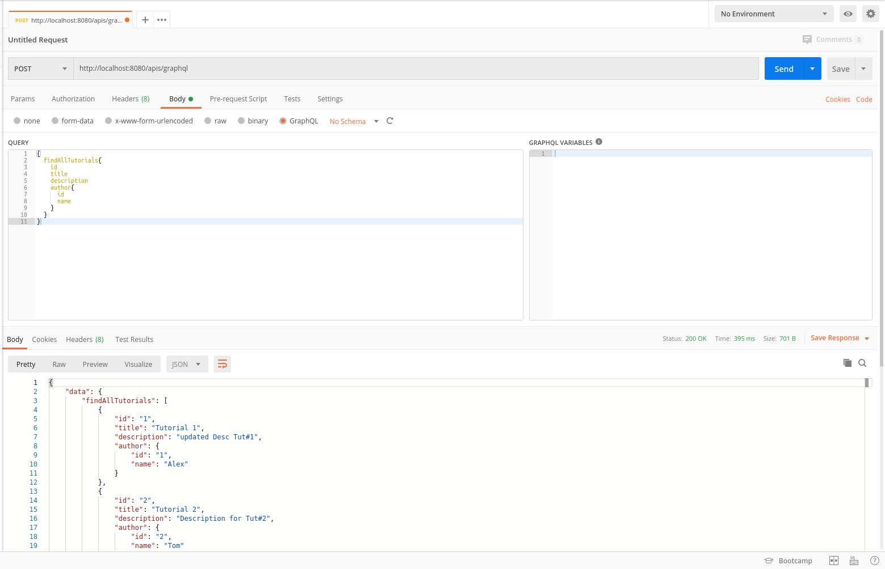

# Spring. Пример взаимодействия с GraphQL

Склонировать проект: `https://github.com/camward/Spring-GraphQL.git`

В файле **application.properties** указать настройки к подключению БД

Создать БД и таблицы (дамп базы *spring_graphql.sql* находится в корне проекта)

Подтянуть зависимости и запустить проект

*Запросы будут доступны по адресу `http://localhost:8080/apis/graphql`*

## CRUD GraphQL API

*Создать автора*

`mutation {
   createAuthor(
     name: "bezkoder",
     age: 27) {
       id name
   }
 }`

*Создать курс*

`mutation {
   createTutorial (
     title: "Tutorial #1",
     description: "Description for Tut#1"
     author: 1)
     {
       id title author { name }
     }
 }`
 
*Получить всех авторов*

`{
   findAllAuthors{
     id
     name
     age
   }
 }`
 
*Получить все курсы*

`{
   findAllTutorials{
     id
     title
     description
     author{
       id
       name
     }
   }
 }`
 
*Обновить курс*

`mutation {
   updateTutorial (
     id: 2
     description: "updated Desc Tut#2")
     {
       id title description author { name }
     }
 }`
 
*Удалить курс*

`mutation {
   deleteTutorial(id: 1)
 }`
 
*Подсчет количества курсов*

`{
   countTutorials
 }`

